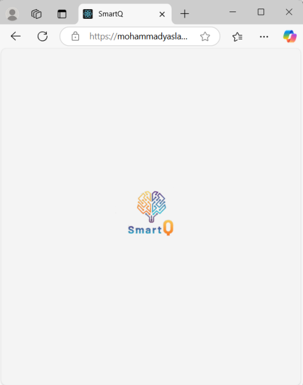

# SMARTQ - Queue Management System

## Project Idea (SmartQ: A Queue Management Web App):

SmartQ is a React-based web application designed to address the common problem of inefficient queue management in service
environments. Using third‑party APIs such as Firebase for real‑time
database, authentication, and notifications, SmartQ allows businesses to
create, manage, and monitor queues while providing customers with a
seamless process to join queues via QR codes, view their estimated wait
time, and track their position in real time.

## Problem:

A variety of service-focused businesses like a clinic, restaurant, or even
a government office face challenges when it comes to controlling long
queues and wait times because it could result in customer dissatisfaction
. This ultimately leads to service launge inefficiency while wasting time,
which is unproductive. SmartQ hopes to alleviate problems related to
queues with an app that permits joining a queue digitally, allowing
customers to monitor and join the queue from outside the premise,
leading to reduced congestion and smoother service delivery. Properties
like clinics, restaurants, and government offices tend to face challenges
managing wait times, which often results in inefficient service and
customer annoyance. SmartQ offer a digital approach to optimize the
2 | P a g e
queue system by enabling customers to digitally join queues, minimizing
congestion and promoting better service overall.

## Target users and how it will help them:

### - Businesses:
Such users have the ability to control queues with relative ease through
an intuitive admin dashboard, track the wait times of customers, and
control the pace of service delivery as needed.
### - Customers:
The end users have the ability to join active queues by simply scanning
QR codes, get real time insights about their current standing in the
queue, and receive timely alerts notifying them that their time has come.
Hence, the waiting time is reduced and greatly improves the user
experience.

## Paper Prototype/UI Mockups (HTML Pages):

## 2. Authentication Page (Login/Register)

## 3. Authentication Page (Register)

## 4. Admin Dashboard

## 5. Queue Controls (Admin management)

## 6. Join Queue Page

## 7. Queue Status Page (for customers)

## 8. Queue Paused Page

## 9. Invalid Queue Page

## 10. Farewell Page

